# Hangman | Python Terminal Game! 

My idea for this project was to develop an online game for players to enjoy.

The object of the game is to:

- Suggest letters to see if they are contained in the hidden answer.
- If the letter is not in the hidden answer, you lose a life.
- To win the game, continue to suggest letters until all of the letters in the hidden answer are revealed.
- Although, if you guess too many incorrect letters and lose all your lives, the game is lost.

The live link for the site can be found here - https://hangman-project-tf.herokuapp.com/

# Table of contents
- [Design and Planning](#design-and-planning)
  - [Logo Font and Color](#logo-font-and-color)
  - [Error Messages](#error-messages)
  - [Game Process Planning Flow Chart](#game-process-planning-flow-chart)
- [Languages Used](#languages-used)
- [Features](#features)
  - [Existing Features](#existing-features)
    - [Logo and Subtitle](#logo-and-subtitle)
    - [How to Play](#how-to-play)
    - [Select Difficulty](#select-difficulty)
    - [Select Category](#select-category)
    - [Main Game Area](#main-game-area)
    - [Other Features](#other-features)
      - [Guess Answer](#guess-answer)
      - [Adding Game Categories and Answer](#adding-game-categories-and-answers)
  - [Future Features](#future-features)
- [Data Model](#data-model)
  - [Classes and Object Oriented Programming](#classes-and-object-oriented-programming)
- [Testing](#testing)
  - [Test of User Story](#test-of-user-story-game-functionality)
  - [Test on Alternative Browsers](#test-on-alternative-browsers)
  - [Debugging](#debugging)
  - [Validator Testing](#validator-testing)
  - [Unfixed Bugs](#unfixed-bugs)
  - [Libraries and Programs Used](#libraries-and-programs-used)
- [Deployment](#deployment)
- [Credits](#credits)
  - [Content](#content)

# Design and Planning

**Logo Font and Color**

I initially found it difficult to add 'design' to a terminal game and that this was mostly limited to formatting. From some research, I did find the 'pyfiglet' and 'termcolor' libraries which could be used to change text font and add color to text printed in the terminal.

My original design for my Logo was as below, but after some feedback during testing, it was reported that the font was difficult to read and as such, a font was chosen for a better user experience.

*Original Logo*

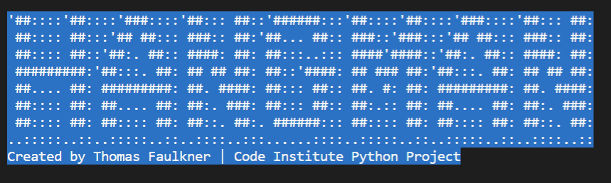

*New Logo*

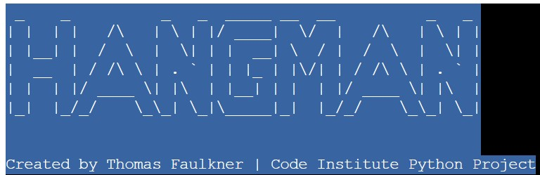

Once the font and color was finalised, it was used for the game won and game lost messages. It was decided for the same color to be used for these messages as the title to keep with the theme of the game.

*Game Won Message*

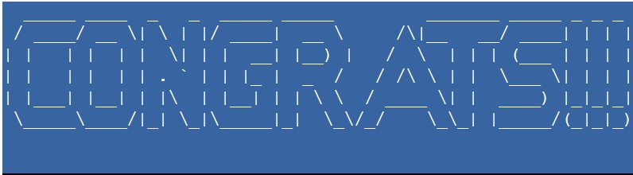

*Game Lost Message*

**Error Messages**

The final bit of coloring added to the game was to highlight error messages in red. This was so they could be distinguished from the game text and to alert the player.

*Sample Error Message - Highlighted Red*

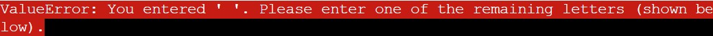

**Game Process Planning Flow Chart**

With there being many steps in the code and different decision stages, I initially planned out the game by setting out in stage on a flow chart (created with LucidChart).

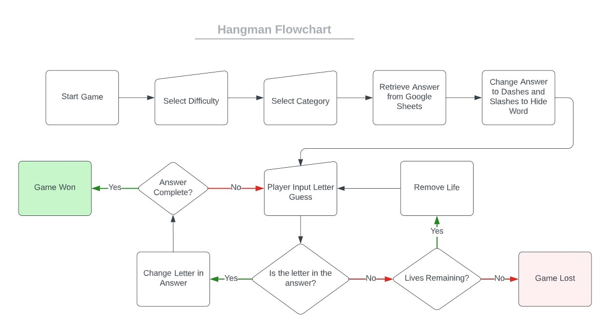

# Languages Used

- Python

# Features

## Existing Features:

### Logo and Subtitle

A logo and subtitle is displayed at the start of the program running so the user is aware of what they are playing.

### How to Play

I have added a 'How to Play?' section to ensure that the player understands the objective of the game. This section also introduces the feature for the player to guess the whole answer at any point in the game.

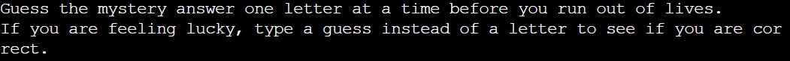

### Select Difficulty

To make the game more interesting for the player, I have added a difficulty level which they are able to select. Each difficulty level corresponds to a number of lives: Easy = 7 Lives; Medium = 6 Lives; Hard = 5 Lives.

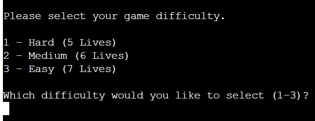

### Select Category

An option has been added for the player to select a category for the answer which they would like to guess. If they player is feeling lucky, they are able to select for a random category to be chosen.

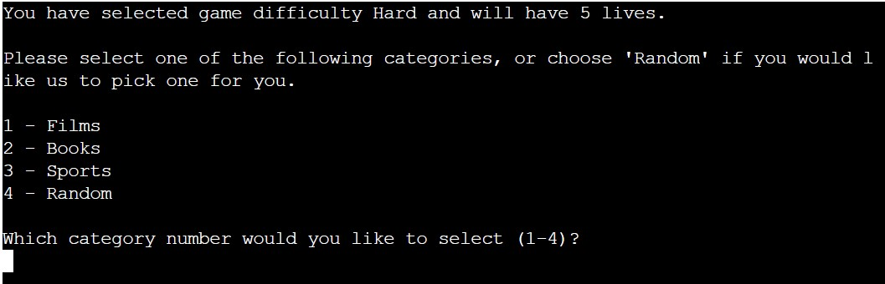

### Main Game Area

- Display Category: Reminds the player of the category of the answer.
- Hidden Word: The word, phase or sentence which the player is trying to guess. This updates as letters are guessed correctly.
- List of Remaining Letters: Reminds the player of the list of letters which they have left to guess from.
- Input Request: Requests for the player to guess a letter or the answer.

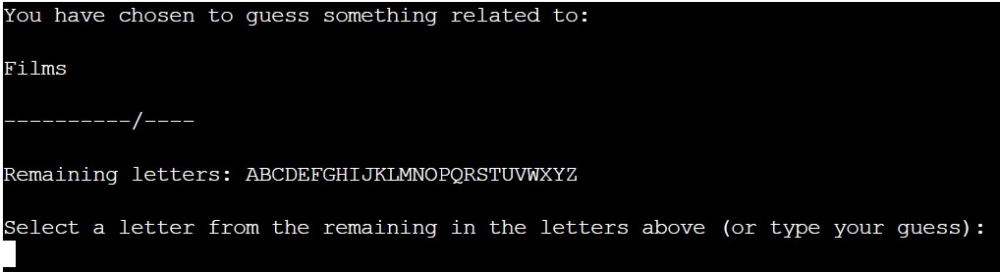

**Additional Displays in the Main Game Area**

- Incorrect Letter Message: A message is displyed when the player selects a letter which is not in the answer.

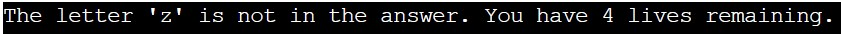

- Hangman Design and Number of Lives Remaining: The hangman design follows the classic design of the Hangman game as an incorrect guess is made. The number of lives remaining is detailed so the player is aware of how many lives they have left. Each Hangman design is incremented differently depending on the difficulty level chosen: e.g. there are 7 steps (lives) from no hangman displayed to a full hangman (Medium: 6 Steps; Hard: 5 Steps). The final full Hangman displayed includes an "R.I.P" message including the date. This has been added as an additional feature.

As there were serval designs required (one for each set of lives for each difficultly), I decided to create these in a seperate file (hangman.py) and call these into the main run.py file to keep the main game play code tidier.

*Hangman Design - Hard with 2 Lives Remaining*

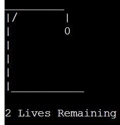

*Hangman Design - Hard with 0 Lives Remaining*

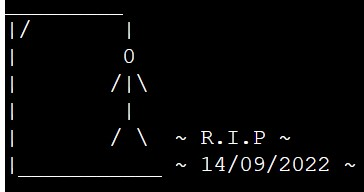

- Error Messages

An error message is displayed when a non-alpha character (e.g. number, symbol, space) is input or a letter is guessed which has previously been guessed by the player.

- Game Won/Game Lost Messages

The font and background color of 'CONGRATS' and 'UNLUCKY' have been changed to signify whether the player has won or lost, respectively. Feedback from testing shown that it was easier for the player to know that they had ether won or lost the game with these messages rather than when they were the same font as the other game text. Providing a larger 'Congrats' message also provides the player with a sense of reward from winning.

*Game Won Message*

*Game Lost Message*

- Request to reset the game

Once the game is either won or lost, the player is asked whether they would like to play the game again. Inputting 'y' re-run the program from the start where as 'n' displays a thank you message.

*Reset Game Message*

*Thank You for Playing Message*

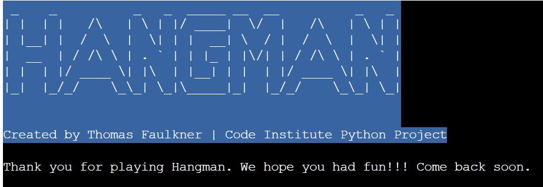

## Other Features:

### Guess Answer

At any point, if the player thinks they know the answer, they can type there guess instead of a letter to see if they are correct and win the game. If an incorrect guess is made, a life will be lost.

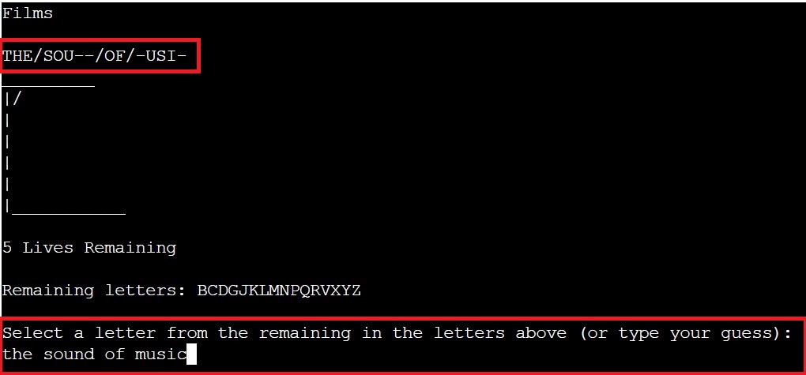

To ensure that there is room for error from the player, the game will only accept an answer guess if it is longer than 3 characters (the shortest answer to guess is 4 characters long). This means that if the player accidentially submits two or three random letters, this is not accepted and an error message is displayed.

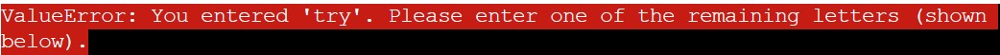

### Adding Game Categories and Answers

I wanted to make sure that the answers and categories of the game were easy to add to. This was to keep the game interesting if players have attempted all of the possible answers in each category.

To do this, instead of having a list of answers as a variable, I set up a Google Sheets with columns of answers based on a category, and an API is used to retreive this information and randomise an answer.

Another bonus to this is that it makes the Hangman game customisable: players could add answers for their favourite category or add keyword for a topic which they are revising.

The game has been programmed so, when a new Categorey is added, this is included as an option to be selected in the Category Section of the game. This category may also be selected when a 'Random' option is selected.

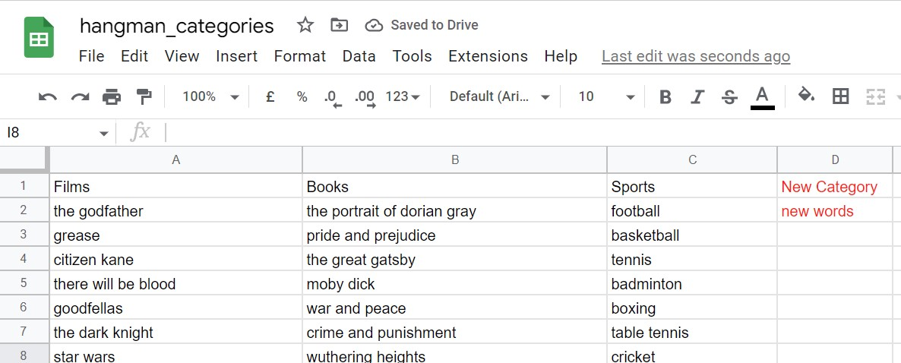

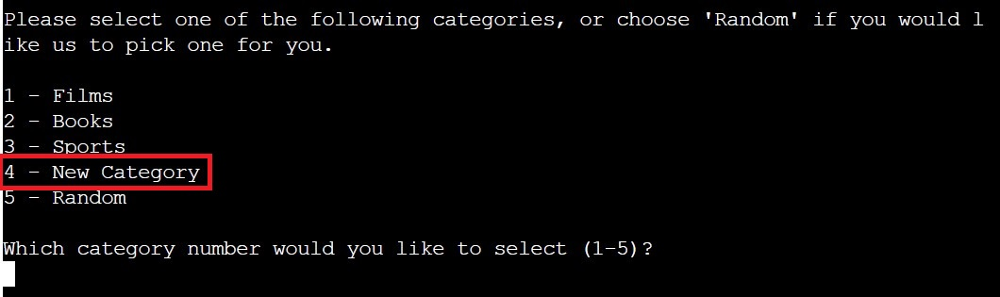

Link for the Category Spreadsheet: https://docs.google.com/spreadsheets/d/1yZvlt76H67GoI1nYCoELXNyLjRzGpB4CzKvvJ7s4E1k/edit#gid=0

To add another Category and/or Answers:

**Add New Category**

1. Type in your new Category in the first row of the next empty column. 

2. Add your new answers in the column under the Category (NB: Ensure that the answers are typed in all lowercase). 

3. Save this file and your new category will be added as an option in the Hangman Game. The new answers added will then be selected randomly.

**Add New Answers in an Existing Category**

1. Just add new answers to the bottom of the list in the appropriate category and they will then be available to be randomly selected in the Hangman Game.

## Future Features

- Add a scoring system
- Add a high score table

# Data Model

## Classes and Object Oriented Programming

I wanted to use a class as a container for the main varibles of the game with methods for updating the game. The main game varibles which have been included in this class are:

- alphabet: list of letters the player has left to choose from
- letter_guess: the players letter guess
- game_word: the answer the player is trying to guess
- hidden_game_word: the hidden answer which is displayed for the player to guess
- lives: number of the lives the player has left
- category: the category chosen by the player

The main function of the game is split into two stages of functions: 

Stage 1. The first stage of functions retrieves the game infromation to define the class varibles.
    - The player selects the game difficulty ("number of lives") and "category"
    - The category is then used to randomly choose a "game word"
    - This is then change into the "hidden game word"

Stage 2: The second stage (play_game fucntion) then uses the class methods to update the game variables and cycles through this until the game is won or lost.

# Testing

## Test of User Story (Game Functionality):

| Test   |      Expected     |  Passed |
|--------|:------------------|:--------:|
|Open Website|Game Title, How to Play and Select Difficulty Displays|☑|
|Select Difficuty|Input of each number selects the appropriate difficulty (Hard, Medium, Easy), then a message displays to inform the player that of the chosen difficulty and the number of lives they have.|☑|
|Select Difficuty Input Validation|An error message is displayed when a non-numeric character (e.g. number, symbol, space) is input or a number which is not a option available.|☑|
|Select Category|Input of each number selects the appropriate category. The category chosen and a hidden random answer from this category is then displayed. Selecting 'Random' chooses a random category for the player. Then displays this and a random hidden word from this category.|☑|
|Select Category Input Validation|An error message is displayed when a non-numeric character (e.g. number, symbol, space) is input or a number which is not a option available.|☑|
|Game Area|The category, hidden answer, letters remaining are displayed. Input message is displayed requesting the player to select a letter.|☑|
|Correct Letter Input|The hidden answer updates displaying all instances of the letter. The game then requests for another letter if the answer is not complete. The letter guessed is removed from the remaining letter available.|☑|
|Incorrect Letter Input|A life is removed. The hangman design is displayed (appropriate to the difficulty chosen and the number of lives remaining). The game then requests for another letter if the answer is not complete. The letter guessed is removed from the remaining letter available.|☑|
|Letter Guess/Guess answer Input Validation|An error message is displayed when a non-alpha character (e.g. number, symbol, space) is input, a letter is guessed which has previously been guessed by the player or two or three letters are input at the same time.|☑|
|Correct Guess Answer|Input	Game won message is displayed and input message asks the player whether they would like to play again.
|Incorrect Guess Answer|Input	Message is displayed that the guess was incorrect. Life is removed if there are some remaining. Hangman design is update now a life has been taken.|☑|
|Game Won|Game won title displays. Game won message displays. Input message asks the player whether they would like to play again.|☑|
|Game Lost|Game lost title displays. Game lost message displays. Final hangman design displays. Date in final hangman is the current date. Input message asks the player whether they would like to play again.|☑|
|Play Again Message|Input of 'y' reloads the games. Input of 'n' displays the game title and the thank you message.|☑|

## Test on Alternative Browsers

|   Test   |   Layout (Pass)   |   Functionality (Pass)   |
|----------|:-----------------:|:-------------------------:|
|Chrome    |      ☑           |            ☑             |
|Safari    |      ☑           |            ☑             |
|Firefox   |      ☑           |            ☑             |
|Edge      |      ☑           |            ☑             |

## Debugging

I was having an issue with the Figlet title in the Heroku deployed version of the game where it started to stack when it should have been clearing the terminal.

<!-- - Checking throughout the code to see if the game_title function had been called more thano once.
- Student Support

Solution -->

## Validator Testing

- PEP8Online: No errors raised in both of the run.py and hangman.py files.

*PEP8 Online Checker: run.py file*

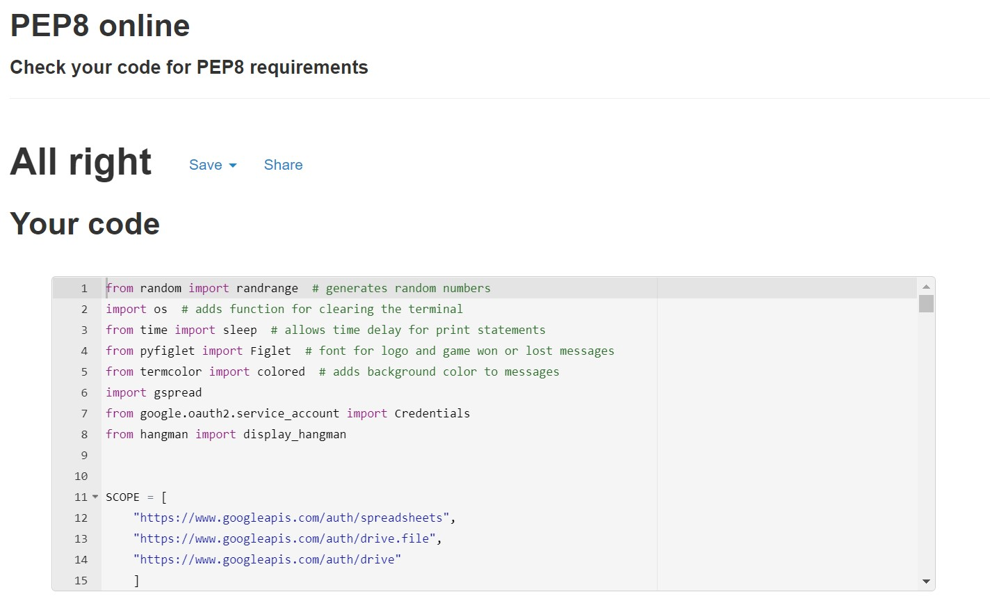

*PEP8 Online Checker: hangman.py file*

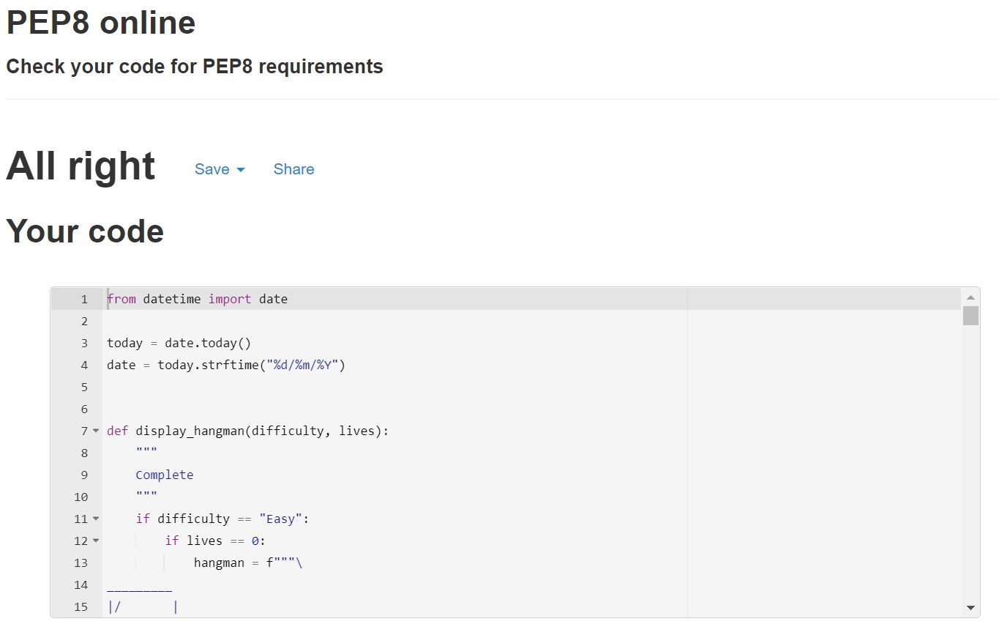

- Lighthouse (Accessibility Audit): The page achieved a great accessibility performance.

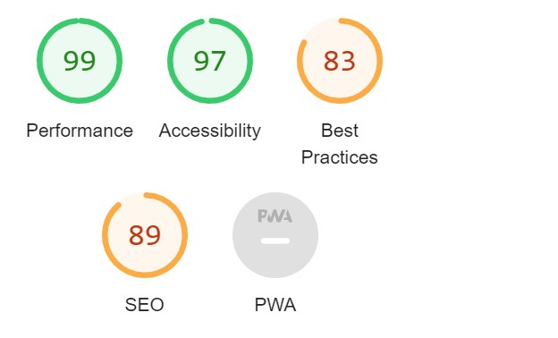

## Unfixed Bugs

There were no unfixed bugs identified during the testing of this site.

## Libraries and Programs Used

- Github: Store Repository
- Gitpod: Create the html and css files
- Google Chrome, Microsoft Edge, Mozilla Firefox, Safari: Site testing on alternative browsers
- Microsoft OneNote: Planning notes for the project
- Am I Responsive: Screenshots of the final project for the README file

# Deployment

This project was deployed on Heroku using Code Institute's Python Essentials template. The steps taken to create the Heroku App were:

**Preparing for deployment on GitHub:**

1. Add a new line character ("\n") after each input request
2. Type into the terminal 'pip3 freeze > requirements.txt' to update this file with a list of dependencies which Heroku needs to download for the application to work

**Deploying on Heroku:**

1. Create App
2. Add creds.json file information to the Apps Config Vars
3. Add the 'Python' and the 'Nodejs' buildpacks
4. Select the GitHub Delpoyment Method, and confirm the connection to GitHub
5. Search and connect to the Hangman Game GitHub Respository
6. Enable 'Automatic Deploys'
7. Then Maually deploy by selecting the 'Deploy Branch' button
8. The app will then be successfully deployed: press the 'view' button to open the deployed site 

The live link for the site can be found here - https://hangman-project-tf.herokuapp.com/

# Credits

## Content

Resources Used:

https://docs.gspread.org/en/latest/
https://stackoverflow.com/questions/3996904/generate-random-integers-between-0-and-9
https://www.geeksforgeeks.org/python-convert-list-characters-string/
https://stackoverflow.com/questions/2084508/clear-terminal-in-python
https://towardsdatascience.com/prettify-your-terminal-text-with-termcolor-and-pyfiglet-880de83fda6b
http://www.figlet.org/examples.html
https://www.pressthered.com/adding_dates_and_times_in_python/
https://realpython.com/python-sleep/
https://www.programiz.com/python-programming/datetime/current-datetime

Hangman Design:

https://codereview.stackexchange.com/questions/214471/display-command-line-hangman

Categories list:

https://www.timeout.com/film/best-movies-of-all-time
https://www.imdb.com/chart/top/
https://games4esl.com/list-of-sports/
https://thegreatestbooks.org/
https://www.goodreads.com/list/show/1.Best_Books_Ever
https://www.alistofbooks.com/

Code Institute's Love Sandwiches Walkthrough Project:

- Getting Set Up (Creating the Google Sheets API)
- Deployment (Deployment to Heroku)
